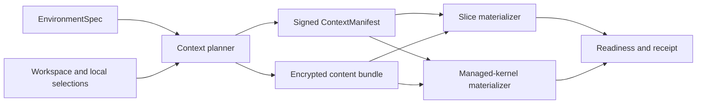

# M28: Environment Context Materialization

Status: proposed  
Scope: `arroba` runtime, slices, independently authoritative managed kernels  
Cloud companion: `arroba-cloud/docs/C9_MANAGED_REMOTE_KERNELS_MILESTONE.md`

## 1. Outcome

Arroba should be able to turn an empty execution environment into one in which an
agent can work correctly without the user manually recreating their development
setup.

The same mechanism serves two different runtime topologies:

1. **Slice context**: a kernel-created slice receives the project, toolchain,
   instructions, an exact logical replica of the parent kernel's agent
   capabilities and Vault, and the network access needed by the agents assigned
   to that slice. The parent kernel remains authoritative.
2. **Managed remote kernel context**: Arroba Cloud provisions a machine and an
   independent Arroba kernel there. That kernel owns its own sessions, agents,
   history, workspaces, child slices, and provider runs. After bootstrap it does
   not depend on a user's laptop.

This milestone is primarily a context-materialization feature. It is not a
remote-worker lease feature and it does not require moving an already-running
session between kernels.

## 2. Product contract

The user-facing operation is:

> Create an execution environment for this project and make it ready for my
> agents.

The source computer is optional. Arroba supports two entry paths:

- **From a current workspace**: use the local repository plus a reviewed overlay
  of uncommitted work and selected personal context.
- **From a repository**: start from web, mobile, or any Arroba client; the new
  kernel clones the repository, reads its checked-in environment and agent
  declarations, and performs any provider/SCM/browser enrollment inside the
  remote environment.

The second path is the normal “I do not need a computer” flow. Context which exists
only on a particular laptop cannot be inferred when that laptop is absent; it must
instead live in the repository or be replicated from another reachable kernel.
When no source kernel exists, Arroba creates the first managed kernel with its
standard capability set and an empty Vault, then lets the user enroll additional
capabilities and credentials directly there.

Arroba must:

- determine which context is required;
- show the user what will be transferred or provisioned;
- provision a slice or independent remote kernel;
- materialize reproducible context from declarations where possible;
- replicate the source kernel's complete capability inventory and encrypted Vault;
- transfer the reviewed non-reproducible project context;
- verify readiness before starting the agent;
- preserve the environment according to its lifecycle policy; and
- report anything that still needs a one-time user action.

“Automatic” means that Arroba plans and performs the safe operations. It must not
silently copy a home directory, browser profile, Keychain, SSH directory, ambient
environment variables, or credentials outside the Arroba Vault. The Arroba Vault
is different: it is a deliberately portable, encrypted kernel-owned object and is
replicated as part of the kernel context contract.

## 3. What Ona documents

Research was checked against Ona's public documentation on 2026-08-11.

Ona's model is useful because it treats a remote environment as a composition of
declared and enrolled context, not as a clone of the user's laptop:

- Ona separates a management plane from runners. Runners provision isolated
  environments, access source code, inject secrets, and execute agents and build
  tasks. See [Architecture](https://ona.com/docs/ona/understanding/architecture)
  and [Runners](https://ona.com/docs/ona/runners/overview).
- An environment is an isolated VM configured using a Dev Container. Source,
  tools, storage, and compute are part of the environment. See
  [Environments](https://ona.com/docs/ona/environments/overview) and
  [Dev Container configuration](https://ona.com/docs/ona/configuration/devcontainer/overview).
- Prebuilds snapshot the built development filesystem without user secrets, and
  warm pools reduce creation latency. See
  [Prebuilds](https://ona.com/docs/ona/projects/prebuilds) and
  [Warm pools](https://ona.com/docs/ona/projects/warm-pools).
- Repository instructions, skills, MCP configuration, dotfiles, tasks, and
  services are separate context sources. See
  [AGENTS.md](https://ona.com/docs/ona/agents-md),
  [Skills](https://ona.com/docs/ona/agents/skills),
  [MCP](https://ona.com/docs/ona/mcp),
  [Dotfiles](https://ona.com/docs/ona/configuration/dotfiles/overview), and
  [Tasks and services](https://ona.com/docs/ona/configuration/tasks-and-services/overview).
- Secrets can be scoped and exposed as environment variables or files. File
  secrets are intended for values such as SSH keys, service-account JSON, and
  kubeconfig. Ona also documents a credential proxy which substitutes a real
  authorization header only for allowed HTTPS targets. See
  [Secrets](https://ona.com/docs/ona/configuration/secrets/overview),
  [File secrets](https://ona.com/docs/ona/configuration/secrets/files), and the
  [`credentialProxy` API](https://ona.com/docs/api-reference/resources/secrets/methods/create/).
- Ona supports OIDC for short-lived cloud credentials. See
  [OIDC](https://ona.com/docs/ona/configuration/oidc).
- Ona's browser runs inside the remote environment. A user can interactively sign
  in there and the agent shares that remote session. The documentation does not
  claim to import a user's local Chrome cookies or password store. See
  [Web browser](https://ona.com/docs/ona/integrations/web-browser).
- Stopping an environment preserves its disk; archive removes it later. An active
  agent prevents idle stopping, and Ona provides a separate keep-alive mechanism
  for non-agent work. See
  [Persistent storage](https://ona.com/docs/ona/environments/persistent-storage)
  and [Environment timeout](https://ona.com/docs/ona/organizations/policies/environment-timeout).

The important inference is that Ona achieves portability through layers:
version-controlled environment declarations, source checkout, prebuilt images,
startup tasks, explicit agent configuration, explicitly enrolled credentials,
and persistent remote state. Its public documentation does not describe an
automatic opaque copy of all local-machine context.

## 4. Current Arroba foundation and gaps

Arroba already has most runtime primitives:

- the kernel is the authority for sessions, agents, workspaces, history, provider
  runs, terminal events, and state transitions;
- local Docker slices build and start a kernel and relay runtime;
- slice state can persist a Docker image and `/home/slice` archive;
- provider-native credential files can be imported for a local managed slice;
- skill packages can be materialized into capability-isolated environments;
- remote kernels can validate worker-local MCP and skill availability;
- encrypted kernel-to-kernel relay transport and scoped relay tokens exist;
- the home credential client can perform one-operation secret injection without
  putting the value into the agent transcript.

The gaps are:

1. Slice creation assumes that a host workspace bind mount is sufficient. It does
   not plan and verify the entire environment needed by the application.
2. There is no canonical, versioned description of project, toolchain, agent,
   integration, credential, browser, and network context.
3. Context import is a set of backend-specific operations rather than one planner
   and materializer shared by slices and remote kernels.
4. There is no readiness report explaining which capabilities work, which require
   login, and which cannot operate while the source machine is offline.
5. Cloud can pair and describe user machines but does not yet provision an
   independent, Arroba-managed kernel.

## 5. Core abstraction

Introduce an `EnvironmentSpec`, a planned `ContextManifest`, and a realized
`EnvironmentReceipt`.

### 5.1 EnvironmentSpec

The desired, reviewable configuration. It may be checked into the repository as
`.arroba/environment.toml`, synthesized from a Dev Container, or created in the
TUI.

```toml
version = 1

[project]
source = "git"
repository = "https://github.com/example/project.git"
revision = "main"
include_working_changes = true

[runtime]
devcontainer = ".devcontainer/devcontainer.json"
cpu = 4
memory_mb = 16384
disk_gb = 80

[agent_context]
repository_instructions = true
kernel_context = "exact_replica"

[integrations]
mcp = ["github", "sentry"]

[vault]
replication = "exact_snapshot"

[network]
policy = "restricted"
targets = ["git.example.com:22", "api.staging.example.com:443"]

[lifecycle]
idle_timeout_minutes = 30
persist = true
```

The exact serialized shape must be introduced through the protocol-change rule:
version bump, shape snapshots/hashes, client minimum version only when the client
depends on the new shape, and a focused drill.

### 5.2 ContextManifest

The planner resolves the specification and current workspace into immutable,
content-addressed inputs:

- base runtime and Arroba runtime versions;
- repository URL, revision, submodules, and sparse-checkout rules;
- encrypted working-tree overlay digest;
- Dev Container/Dockerfile/Compose inputs and lockfiles;
- setup tasks and required services;
- repository instructions and a complete kernel capability snapshot digest;
- exact MCP, skill, script, connector, and extension descriptors/package hashes;
- an encrypted Vault snapshot reference and unlock policy;
- browser profile policy;
- network destinations and connector requirements; and
- declared persistence and resource policy.

The manifest contains references and policy, never secret values.

### 5.3 EnvironmentReceipt

The target materializer records what it actually installed:

- resolved image digests and package/tool versions;
- source revision and overlay digest;
- agent instruction and skill hashes;
- available MCP/extensions;
- credential handles present, without values;
- verified network targets;
- setup/readiness check results; and
- warnings which make the environment only partially ready.

This receipt makes slice bugs reproducible and lets a managed kernel explain how
its environment differs from the source machine.

### 5.4 ContextBundle

The “bundle” is one logical transfer, but it is not one indiscriminate archive.
Keeping its parts separate lets Arroba cache safe inputs without caching secrets:

1. **Manifest**: signed metadata, digests, paths, policies, and requirements; no
   secret values.
2. **Source pack**: the selected working-tree overlay and any source which cannot
   be cloned at the target.
3. **Kernel capability pack**: the complete registered set of extensions, MCPs,
   skills, scripts, and connectors, including exact versions, configuration,
   package contents, and policy, all individually hashed.
4. **Vault replica envelope**: a consistent encrypted snapshot of the complete
   Arroba Vault, including entry metadata and policies, bound to the target kernel
   identity. Secret values remain encrypted throughout transfer.
5. **Bootstrap actions**: ordered, idempotent setup and readiness operations.

Each part is content-addressed, chunked, resumable, and target-encrypted. A repeat
creation sends only hashes the target or prebuild cache does not already possess.
Secrets are never included in reusable source, capability, image, or prebuild
caches.

### 5.5 Exact kernel-context replication

For a managed slice or managed remote kernel, capability choice is not a repeated
per-environment checklist. Arroba takes a point-in-time logical snapshot of the
source kernel and reproduces it by default:

- the same compatible Arroba kernel release and protocol capabilities;
- every installed extension and its configuration;
- every MCP registration, package/version, transport configuration, and secret
  handle reference;
- every skill package and script with its content hash and precedence;
- every connector definition, permission policy, and target metadata; and
- the complete encrypted Arroba Vault with entry IDs, values, metadata, host/use
  policies, and deletion markers.

“Exact” means identical logical inventory and content hashes, not copying the
source operating system or running processes byte for byte. The target
materializer verifies the snapshot and refuses to report full readiness when an
item cannot run on the target platform. For example, a connector implemented only
through a local macOS application can be faithfully registered but cannot become
operational on Linux without a remote implementation or durable connector.

The Vault transfer is a consistent encrypted snapshot, never a series of
plaintext secret reads. The source vault coordinator freezes a revision, exports
authenticated ciphertext, and seals the snapshot or its data key to the target
kernel identity. Cloud and the relay see only ciphertext. The target owns its
replica and can operate after the source kernel disappears; unlock and TTL policy
are enforced by the target kernel through normal runtime interactions.

The first implementation is point-in-time replication at creation. A later
`refresh context` operation can send a signed delta for newly installed
capabilities, changed configuration, Vault revisions, and tombstones. Automatic
bidirectional synchronization is not required and would need an explicit conflict
and revocation model.

The source may itself be an already-managed remote kernel. Once the user's first
managed kernel is running, it can create fully populated slices and additional
managed kernels without involving a laptop. If no kernel containing the desired
Vault is reachable, Arroba cannot conjure that Vault: the user must start with an
empty one, unlock an independently retained encrypted backup, or bring an existing
kernel online. Cloud must not retain a decryptable master copy merely to hide this
constraint.

### 5.6 Seamless creation flow

The first iteration should feel like one operation even though provisioning and
materialization have several internal stages:

```text
arroba environment create --remote --from-current-workspace

Inspecting project .......... done
Planning context ............ done
Provisioning machine ........ running
Preparing context bundle .... running
Starting Arroba kernel ...... pending
Applying project context .... pending
Checking agent readiness .... pending
Opening remote session ...... pending
```

Internally Arroba should:

1. inspect the current project and infer a draft spec;
2. ask once to unlock/authorize the encrypted Vault snapshot and resolve any
   non-portable capabilities;
3. provision the machine while building and encrypting the context bundle in
   parallel;
4. boot and authenticate the independent kernel;
5. stream the bundle directly to that kernel and materialize it;
6. run readiness checks using the actual provider, tools, integrations, and
   network targets;
7. create the workspace/session on the remote kernel; and
8. attach the user's current client to it.

When creation starts from a repository instead of a local workspace, the source
pack is normally empty: the target clones source and obtains all other context from
the checked-in declaration and, when available, a kernel-context snapshot from an
existing kernel. Otherwise it uses the standard kernel profile and interactive
enrollment against the new kernel.

For a slice, steps 3 and 4 become slice creation, while every planning,
materialization, readiness, and attachment step remains the same. The user may
leave as soon as a managed remote kernel has accepted durable ownership of the
operation; creation progress then remains visible from another client.

Normal operation should require no questions. Arroba interrupts only for an
unsafe ambiguity, explicit secret selection, provider/browser login, or a failed
readiness requirement. The final screen says either “ready” or precisely which
capability remains unavailable; it never leaves the user guessing whether a
partially configured agent can work.

## 6. One pipeline, two targets



The planner and manifest are shared. Target adapters differ only where their
topology actually differs.

### 6.1 Slice target

- The existing parent kernel creates the slice.
- The parent can use a bind mount for a local slice, but the manifest still
  describes the source and overlay so the setup is reproducible.
- For an SSH/Docker or other non-local slice, source is cloned or transferred and
  the same overlay is applied; no host-path mount is assumed.
- The slice kernel remains a worker of the parent kernel.
- Parent-proxied tools and secrets may be used while the parent is reachable.
- If the slice must survive source-machine disconnection, readiness must reject
  required capabilities that exist only through a live home proxy.

### 6.2 Managed remote-kernel target

- Cloud provisions a machine and bootstraps an independent Arroba kernel.
- The remote kernel creates and owns its own userspace runtime records: sessions,
  agents, workspaces, child slices, provider runs, history, and terminal streams.
- A source machine is only a provisioning client. It is not the home kernel for
  those sessions and is not in their runtime data path.
- The remote kernel attaches directly to the hosted relay using its own scoped
  identity, so web, TUI, iOS, and future Android clients can attach through the
  normal kernel protocol.
- Once context has been materialized and offline-required credentials are present,
  the source machine can disappear without affecting agent execution.

Moving an existing session from one independent kernel to another is a separate
future export/import protocol. It must not be smuggled into this milestone.

## 7. Context layers

### 7.1 Source and uncommitted work

Prefer a remote clone using a scoped SCM credential. Then create an encrypted,
content-addressed overlay containing explicitly selected staged, unstaged, and
untracked files.

Defaults:

- include tracked modifications and selected untracked files;
- preserve file modes, symlinks, submodule state, and Git LFS intent;
- exclude ignored files, build outputs, sockets, device files, `.git` internals,
  `.env*`, private keys, credential databases, and oversized files;
- show a size and sensitivity summary before transfer; and
- record source revision plus overlay digest in the receipt.

An explicit override may include an ignored file, but the planner must call it out
as potentially sensitive. The bundle is encrypted to the target kernel identity;
Cloud may transport opaque bytes but cannot decrypt them.

### 7.2 Toolchain and application dependencies

Resolution order:

1. repository Dev Container configuration;
2. repository `.arroba/environment.toml`;
3. a generated proposal based on lockfiles and tool-version files; or
4. an explicit base-image selection plus setup tasks.

The planner should recognize common manifests, but inference is advisory. It must
not attempt to duplicate arbitrary packages from macOS into Linux or copy an
entire local Docker state. Builds should pin image digests and record results.

Use prebuilt images keyed by the environment-build digest. Secrets are injected
only after the reusable image is built, so they cannot enter image layers or build
logs.

### 7.3 Agent instructions, skills, MCP, and extensions

- Repository-owned instructions and capability configuration travel with source.
- The complete home-kernel capability inventory uses the existing hashed package
  protocol and is materialized into the target's capability isolation root.
- MCP and extension descriptors are transferred separately from credentials.
- The target checks that required binaries, transports, and endpoints exist.
- A capability must declare whether it is target-local, remote-service backed, or
  source-kernel proxied.
- A managed remote kernel cannot be marked offline-ready when a required
  capability is source-kernel proxied.

This deliberately preserves the current standard paired-worker contract. Arroba
does not copy personal capabilities or Vault data to arbitrary user-operated
workers; exact replication applies only to user-approved managed slices and
Arroba-managed kernels.

### 7.4 Provider harnesses

Codex, OpenCode, and Claude continue to run only through their official harnesses.
The environment declares the required provider and harness version range; the
base image installs the supported harness.

Authentication options, in preferred order:

1. perform the provider's native device/OAuth login against the remote harness;
2. use a provider-supported service/workload identity;
3. explicitly import the minimal provider-native credential artifact when that is
   supported and the user consents.

Arroba must not normalize provider credentials into an Arroba-owned cloud token
store or become the owner of provider-internal session state.

### 7.5 Vault replication and external credentials

The complete Arroba Vault is copied as the encrypted, revisioned snapshot described
above. Credentials outside that Vault remain named requirements; Arroba does not
discover them by scanning the home directory.

Each requirement declares one delivery mode:

- `workload_identity`: obtain a short-lived token through OIDC or the target
  platform's identity;
- `operation_proxy`: use an existing one-operation vault proxy; suitable only
  while the proxying kernel remains online;
- `sealed_target_secret`: encrypt the selected secret to the target kernel and
  store it in the target's encrypted vault;
- `file_secret`: materialize with strict mode at a declared path; or
- `interactive_enrollment`: the user signs in or pastes a value directly into the
  target environment.

Secret values must not appear in the manifest, environment receipt, Cloud state,
logs, shell history, agent messages, or provider transcripts. Long-lived values
should be replaced by narrowly scoped, short-lived credentials whenever possible.

### 7.6 SSH access from the environment

There is no safe automatic way to make every local SSH capability work after the
laptop closes. Local SSH-agent forwarding would retain a dependency on the laptop.

Supported patterns should be:

1. issue a short-lived SSH certificate or per-environment key and register its
   public key on the destination;
2. materialize an explicitly selected key as a sealed file secret;
3. use a remote Vault/SSH CA or workload identity; or
4. keep an interactive source-kernel proxy, which readiness labels as not
   offline-capable.

Every SSH requirement includes allowed host/port patterns, host-key policy,
expiry, and whether agent forwarding is allowed. Default-deny forwarding and
never copy `~/.ssh` wholesale.

If the destination is reachable only through the user's laptop or LAN, Arroba must
also provision durable connectivity: a WireGuard/Tailscale-style connector,
customer network runner, VPN, or bastion. Credentials alone do not create network
reachability.

### 7.7 Browser state

The managed browser and its profile live in the slice or remote environment. The
preferred flow is:

1. open the remote headed browser through Arroba;
2. let the user sign in once, optionally using a target-restricted vault action;
3. persist the remote browser profile with the environment; and
4. let agents and the user share that same remote browser session.

Arroba should not automatically import the local Chrome/Firefox profile, cookies,
password database, or platform-bound passkeys. Those artifacts can be encrypted
to a device or OS account, carry broad ambient authority, and may violate website
session policies. A future, per-site migration assistant may be explored, but it
must be explicit and must expect reauthentication.

## 8. Planning and readiness UX

Before creation, show a concise plan grouped by:

- source and working changes;
- environment build and setup tasks;
- agent instructions and skills;
- MCP/extensions;
- provider authentication;
- credentials and SSH destinations;
- browser enrollment;
- network connectivity;
- persistence, resource size, region, and idle policy; and
- estimated transfer size and build reuse.

Each requirement has one state:

- `ready`: verified on the target;
- `action_required`: a safe one-time user operation remains;
- `degraded`: optional context is unavailable; or
- `blocked`: the agent must not start.

The default creation flow may pause only for `action_required` or `blocked`
requirements. Re-running materialization is idempotent and sends only changed
content hashes.

## 9. Runtime boundaries and security invariants

1. The kernel remains runtime authority. Cloud provisions and controls lifecycle;
   it does not proxy prompts, terminal traffic, history, provider payloads, or
   secret operations.
2. The relay remains an opaque scoped packet router.
3. A managed remote kernel is an independent kernel, not a leased worker attached
   to the user's laptop.
4. Only declared project context and the exact Arroba kernel context cross the
   boundary. There is no implicit whole-home snapshot.
5. Context bundles and Vault replicas are authenticated, content-addressed,
   encrypted to a target kernel identity, replay-protected, expiring in transport,
   and deletable after application.
6. Bootstrap tokens are single-use and short-lived. Runtime identities are issued
   only after the expected image/runtime attests and exchanges the bootstrap
   token.
7. Reusable images and prebuild caches contain no user secrets.
8. Target kernels store offline-required secrets only in their encrypted vault,
   with explicit host/use policy and audit metadata.
9. Hosted machine administrators can potentially inspect a running VM's memory.
   Product language must disclose this trust boundary; disk encryption alone does
   not remove it.
10. Environment deletion revokes runtime and relay credentials, destroys the data
    key, removes storage, and marks relay targets stale immediately. Provider-side
    credentials may still require provider-side revocation.

## 10. OSS implementation shape

Keep policy out of coordinators. Suggested responsibility modules:

- `environment/spec`: parsing, validation, versioning;
- `environment/planner`: context discovery and user-visible transfer plan;
- `environment/bundle`: content-addressed archive, encryption, resumable transfer;
- `environment/materializer`: idempotent target application;
- `environment/readiness`: probes and receipt generation;
- `environment/credentials`: delivery policy adapters;
- `environment/network`: destination policy and connectivity probes;
- `environment/browser`: remote profile lifecycle; and
- target adapters for `local_docker_slice`, `ssh_docker_slice`, and
  `managed_remote_kernel`.

The existing slice coordinator should only wire lifecycle calls to these modules.
The managed-kernel bootstrap agent should use the same materializer rather than a
second Cloud-specific implementation.

Likely protocol work includes:

- environment spec/plan/readiness types in the shared model;
- local daemon requests for plan, create/apply, inspect, refresh, and delete;
- encrypted bundle upload/download and apply acknowledgements;
- managed target identity and bootstrap status;
- receipt/event projection to every client; and
- capability offline-readiness metadata.

Any change to `LocalDaemonRequest`, `LocalDaemonResponse`, relay terminal events,
browser/kernel terminal semantics, or serialized peer messages must follow the
protocol-change rule and include a focused drill.

## 11. Delivery sequence

### Phase 0: contracts and threat model

- Define trust classes: arbitrary paired worker, managed slice, independent
  Arroba-managed kernel.
- Specify `EnvironmentSpec`, `ContextManifest`, `EnvironmentReceipt`, sensitivity
  filters, target identity, bundle encryption, and deletion semantics.
- Add protocol shape/version tests before wiring clients.

Exit: a planner can produce and render a stable plan without provisioning.

### Phase 1: slice materialization

- Refactor local Docker slice setup behind the shared materializer.
- Add source/overlay planning even when a local bind mount is available.
- Implement the missing non-local SSH/Docker source materialization path.
- Materialize Dev Container/toolchain, instructions, and the exact source-kernel
  capability/Vault snapshot.
- Produce a readiness receipt and block agent start when required setup fails.

Exit: the same repository can be created as local or non-local slice and pass the
same application setup/test drill without manual copying.

### Phase 2: independent managed kernel

- Bootstrap a signed Arroba runtime on an Arroba-managed VM.
- Give it an independent kernel identity, persistent kernel state, direct hosted
  relay connectivity, and a lifecycle controlled by Cloud.
- Apply the same manifest and bundle used by slices.
- Create sessions and agents directly on that kernel.

Exit: a user starts a new remote session, disconnects the source computer, and the
agent completes while clients can reconnect through the relay.

### Phase 3: credential and network profiles

- Add provider-native remote login flows.
- Add sealed target vault entries, workload identity, file-secret policies, and
  credential rotation/revocation.
- Add SSH destination profiles and durable private-network connectors.
- Mark source-proxied capabilities as not offline-ready.

Exit: SCM, provider, cloud, and SSH fixture drills succeed without exposing values
to Cloud or transcripts.

### Phase 4: persistent browser and environment lifecycle

- Persist the remote browser profile and expose interactive enrollment.
- Add stop/start, idle policy, active-agent lease, snapshot/backup, quota, and
  cost visibility.
- Add prebuild cache and later warm capacity once cold-start measurements justify
  it.

Exit: a remote browser login and repository state survive stop/start, while delete
fully revokes and removes the environment.

### Phase 5: optional portability

- Export/import environment specs and receipts between independent kernels.
- Consider session export/import only at a quiescent provider boundary with one
  authority at a time.

This phase is explicitly outside the initial remote-environment product.

## 12. Required drills

1. **Slice parity**: local Docker and non-local Docker materialize the same commit,
   dirty overlay, tool versions, skills, and MCP set; application tests pass.
2. **Laptop-offline remote run**: create a session on the managed kernel, start a
   real provider turn, disconnect the source machine, observe completion from a
   second client, and reconnect.
3. **Dirty-worktree safety**: verify selected changes arrive and ignored secrets,
   large outputs, sockets, and Git credential helpers do not.
4. **Provider matrix**: Codex, OpenCode, and Claude authenticate and resume through
   their official harnesses.
5. **Credential policy**: an allowed target receives a secret operation; a denied
   host does not; no value appears in history, terminal events, logs, or Cloud.
6. **SSH**: an expiring per-environment key reaches an allowed fixture host while
   other destinations and agent forwarding are denied.
7. **Browser**: remote interactive login survives stop/start; deletion removes the
   profile. Use a fixture first and treat external sites such as Gmail as
   reauthentication-prone.
8. **Offline capability report**: a source-proxied MCP is rejected for an
   offline-required environment while a target-local MCP succeeds.
9. **Recovery**: relay loss, kernel restart, VM restart, interrupted bundle upload,
   and repeated materialization converge without duplicate sessions or leaked
   resources.
10. **Deletion**: revoke credentials, destroy the data key, remove persistent
    storage, stop billing, and prevent stale relay-target selection.
11. **Protocol discipline**: snapshot/hash tests fail without the required version
    bump and the minimum-client drill covers new dependent behavior.

## 13. Non-goals

- Copying an entire laptop or home directory.
- Importing browser password stores or cookies automatically.
- Forwarding a local SSH agent as the default offline credential strategy.
- Turning Cloud or the relay into runtime/session authority.
- Storing normalized provider credentials in Arroba Cloud.
- Changing the contract for arbitrary paired workers.
- Migrating a live local session to a remote kernel in the first release.

## 14. First implementation slice

The smallest end-to-end implementation should be:

1. a versioned spec and plan for one Git workspace;
2. a safe dirty-worktree overlay;
3. Dev Container build plus setup task;
4. repository instructions plus an exact kernel capability and Vault snapshot;
5. a readiness receipt;
6. the existing local Docker slice target; and
7. the same inputs applied to one independently bootstrapped managed kernel using
   a development provider stub.

That vertical slice proves the shared abstraction before adding broad credential,
browser, networking, persistence, and multi-provider complexity.
