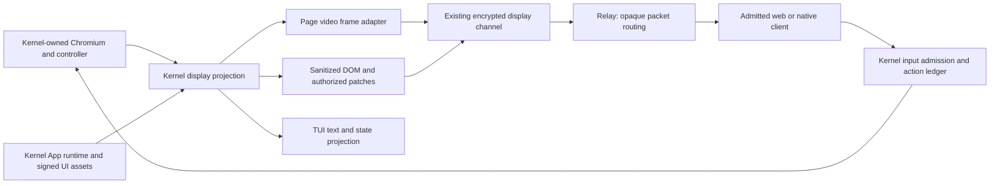

# Multidomain display transport — MD-DISPLAY-01/02/03/04

Research and component prototypes, 2026-10-04, builder2. **Decision remains with
the owner.** The recommendation is to build a transport-neutral browser display
seam and a portable video fallback first, make signed App views native next,
and admit general DOM mirroring only after drift and secret-safety gates pass.
These experiments support keeping mirroring as a selective optimization; they
do not support making it the default for arbitrary pages today.

The owner plan supplies no numbered MD rows. This lane uses MD-DISPLAY-01
(options/prior art), MD-DISPLAY-02 (host video/DOM), MD-DISPLAY-03 (installed
Selkies baseline), and MD-DISPLAY-04 (seam/migration/decisions). These labels
identify deliverables, not accepted product milestones. The frozen Browser/
Computer, Path-1 and M20 gates remain unchanged. No managed or MD acceptance
item is closed here. Production implementation waits for the owner decision
and coordinator-assigned protocol versions.

## MD-DISPLAY-01 — What each option buys

“Send the actual HTML/JS” has two different meanings. Loading remote page code
in every viewer creates another live application with its own cookies, network,
timers and side effects. Mirroring sends sanitized rendered structure/state,
executes source scripts only in the kernel browser, and routes every action
back to that browser. The latter preserves one browser authority. It can keep
text sharp, but does not promise pixel-identical rendering across font stacks,
browser versions, operating systems or different viewports.

| Option | Fidelity: text, colour, scaling/HiDPI | Latency and bandwidth | Host/client CPU and GPU | OS reach and engineering cost |
| --- | --- | --- | --- | --- |
| Native signed App UI per viewer | Native text/selection/accessibility at viewer DPR; local fonts and transient state can differ from agent view. Colour is normal local web rendering. | Local UI feedback; kernel operations still take an RPC. Sends signed assets and state, avoiding video. | Normal client page cost; kernel still runs authoritative App state and the agent's browser copy. | Web on Linux/macOS/Windows, native clients need a webview/renderer and bridge. Medium cost: sandbox/origin, bridge identity, per-viewer state and shared actions. No universal arbitrary-site claim. |
| Sanitized DOM + CSS + assets, with pixel/video patches | Native sharp text and zoom. CSS, pseudo-elements, fonts, shadow roots, CSSOM, animations and layout can drift. Pixels/DRM remain raster. Mixed native/raster colour pipelines need testing. | Sparse mutations can be cheap; full styles, initial assets and many patches can exceed video. Source action → observer → patch apply adds a turn. Client selection can be immediate; authoritative form input cannot just mutate a local clone. | Source observation/style/layout work plus viewer layout; patch capture/encode remains. Our computed-style prototype duplicates some layout work. | Structure protocol is OS independent, fidelity is not. High cost for general web compatibility, resources, drift detection, stale refs, composition and masking. Prototype works on limited controlled pages. |
| Drawing commands / Skia pictures | Potentially scalable glyph/vector geometry and high fidelity, including some canvas. Fonts/images, shader/video paths, colour management and unsupported operations still matter. | Resource caching and command deltas can reduce bytes; decoding/replay/round trips remain. A bandwidth/latency win is unmeasured here. | Instrumented browser recording and client renderer, often WASM; GPU and resource caches needed. | Client portable in principle; modified Chromium hooks require per-platform maintenance. Very high cost; not a documented stable CDP remote compositor feed. Keep as research. |
| Chromium CDP screencast → encoder → existing encrypted display channel | DPR2 source captures work here; video quality depends on codec, bitrate, chroma subsampling and decoder scaling. Text does not become resolution independent. PNG source is lossless before encode. Page content only. | Event-driven capture is useful for static pages; base64 PNG/CDP decode then encode costs latency/CPU. Bytes are content/codec dependent. | PNG encode/decode plus video encode is an avoidable extra pass. WebCodecs exposes codecs, not a guarantee of GPU hardware support. | CDP is available on Chromium across Linux/macOS/Windows; actual support and latency still need OS tests. Medium cost: frame adapter, codec negotiation, rate/queue control, decoder lifecycle. No desktop/native dialog capture. |
| Tab capture / native window capture → encoder → encrypted channel | Removes PNG intermediate; can retain DPR2 pixels. Native capture covers chrome/dialogs/desktop as selected. Video still has chroma/scaling/colour tradeoffs. | Better capture/encoder path is a plausible improvement, not proved by this prototype. | Hardware encoders may reduce host CPU; software fallback required. Client decode usually cheaper than re-layout. | Tab capture requires a trusted Chrome extension and API permission/activation contract. Native capture needs OS adapters, permissions and tests. Medium/high cost; no Chromium fork required for capture APIs. |
| Existing Selkies / noVNC fallback | Raster desktop. Current installed Selkies component performs well on frozen-frame quality; cannot gain native selection or arbitrary zoom. Cursor metadata and viewer scaling are separate from pixels. | Installed Selkies loopback baseline is competitive; noVNC was not newly benchmarked. | X capture + encoder, client decoder. Existing Linux slice runtime cost. | Selkies captures the Linux display inside a slice even on a Mac host. It does not capture a native macOS/Windows browser. Preserve during migration; no Selkies-specific feature investment in this lane. |

The same display selection must work for either domain; domain attachment is
kernel state, not a codec or UI-side policy. A future native App view is an
additional authorized projection, not permission for its viewer to own App
bindings, critical actions or user-domain focus. User-only windows remain
unattached to Rooms; the focused agent's access follows the kernel's focus
record, as in the owner plan.

## MD-DISPLAY-01 — Interaction fidelity

| Interaction | Structure/native App views | Video/drawing views | Required kernel seam and evidence |
| --- | --- | --- | --- |
| IME and keyboard | Viewer composition, source caret, selection and acknowledgement can conflict. Unicode `Input.insertText` passes here; that is not a live IME proof. | Client composition can be forwarded as semantic text/keys; raster caret is remote. | Composition begin/update/commit/cancel, shortcuts, non-US keys, source focus, reconnect cancellation. Preserve ordinary controller input/arbitration. |
| Clipboard and selection | Native selection is valuable for notes/accessibility; copied text must obey source secret policy and selection anchors. | Source selection observer/clipboard is needed. Drawing commands alone do not provide semantic text. | Explicit authorized read/write clipboard operations, Vault restrictions, selection quote/range, size bounds and audit. No plaintext clipboard in relay control messages. |
| Drag/drop | Native DOM drag behavior differs from a reconstructed scriptless page. Need element and pointer semantics, source drag data and browser permissions. | Coordinate mapping is direct; local files and source drag payloads still need transfer support. | Source drag lifecycle and existing upload/download staging; fixture, cross-frame and real app tests. |
| File chooser and browser dialogs | Cannot execute chooser behavior in a source-free clone. | CDP page capture omits browser/native UI; OS/window capture may be needed. | Controller file chooser/dialog APIs + kernel RuntimeInteraction, safe upload staging. Video fallback does not automatically solve permission UI. |
| Cursor | Whitelisted computed cursor names can render natively; custom cursor URLs need authorized assets or default fallback. | CDP frame capture does not give a complete cursor-shape protocol. Host overlays must not force a crosshair. | Trusted cursor type/hotspot and actor overlay above content, one coordinate transform. Owner's Selkies/Mac crosshair complaint remains an unroot-caused report, not a reproduced defect here. |
| Multi-viewer focus/scroll | Per-viewer zoom/selection may be local; shared canonical source viewport and source mutation focus need an explicit contract. | Viewers share raster source geometry; independent resizing can fight without kernel ownership. | One tab, canonical viewport, input owner and action ledger; document/viewport epochs; stale input rejection and takeover across Web/TUI/native. |

The DOM prototype forwards actual native CDP mouse/text input to the source,
so the source's JavaScript handlers execute there. It does not copy those
handlers to the viewer. Element-addressed control passes on ordinary controls;
the cross-origin iframe patch uses mapped coordinates and verifies the source
button's effect. A page rendered as pixels can still be inspected and acted on
through the existing browser controller; agents do not need to act on the
viewer clone. Image-based computer actions need the exact source viewport
transform. Refuse stale epochs instead of guessing after layout drift.

## MD-DISPLAY-01 — Prior art and limits of the evidence

| Primary source, checked 2026-10-04 | What it establishes | What it does not establish for Chariox |
| --- | --- | --- |
| [rrweb guide](https://github.com/rrweb-io/rrweb/blob/main/guide.md) | Full/incremental DOM recording and replay, input/privacy options and existing machinery. | General live bidirectional control, Vault policy, hostile-source safety, or exact cross-OS layout. Its default input masking is not a Chariox policy. Consider its serializers after security review rather than assuming recorder completeness. |
| [Surfly technology](https://help.surfly.com/en/the-surfly-proxy), [security](https://www.surfly.com/security-and-compliance), [Cobrowse masking](https://docs.cobrowse.io/sdk-features/redact-sensitive-data) | Commercial co-browsing demonstrates interaction rewriting and pre-transmission element/field masking. | A drop-in open-source transport, compatibility without integration, or a safe reason to move cookies to a relay. Their deployed architectures differ from Chariox's encrypted transport-only relay. No service was bought or tested. |
| [Cloudflare NVR overview](https://blog.cloudflare.com/cloudflare-and-remote-browser-isolation/), [canvas remoting](https://developers.cloudflare.com/cloudflare-one/remote-browser-isolation/canvas-remoting/), [limitations](https://developers.cloudflare.com/cloudflare-one/remote-browser-isolation/known-limitations/) | Drawing-instruction browser isolation is a deployed product; difficult canvas content can still need a separate remoting path. | Universal perfect canvas/DRM fidelity, an available Chariox Chromium fork, or measured cost/latency on these clients. We did not prototype NVR. |
| [Chromium Paint Preview](https://chromium.googlesource.com/experimental/chromium/src/%2Bshow/refs/heads/lkgr/components/paint_preview/README.md), [player](https://chromium.googlesource.com/chromium/src/+/refs/heads/main/components/paint_preview/player/) | Skia pictures + metadata can record/replay page previews; existing compositor/player code is useful research. | A real-time remote compositing protocol. Previews use capture/compositing/player components; the documented player is principally Android. “Chromium remote compositing” is not an off-the-shelf stable CDP draw-command stream. |
| [CDP Page](https://chromedevtools.github.io/devtools-protocol/tot/Page/), [#607](https://github.com/charioxai/chariox/pull/607) | CDP exposes screencast, screenshot, frame acknowledgement and isolated-world creation. Frozen source has a controller-owned focus world. | CDP screencast is experimental, not a codec stream or desktop capture. #607 is a focus-integrity seam, not a generic DOM observer/resource broker or secret boundary. The isolated world shares the DOM with page code. |
| [WebCodecs specification](https://www.w3.org/TR/webcodecs/), [Chrome tabCapture](https://developer.chrome.com/docs/extensions/reference/api/tabCapture) | Browser codec configuration/support probing and encode/decode queues; a documented tab media capture API exists. | Mandatory codec/hardware availability, transport, security admission, or automatic background capture permission. Probe supported configurations on both ends. Tab capture has its extension/activation requirements. |

## MD-DISPLAY-02/03 — Reproducible component experiment

Prototype source, commands and limits are in
[`experiments/multidomain-display/README.md`](../experiments/multidomain-display/README.md).
No accounts, provider harnesses, paid services, real Vault values, external
relay, Apps machine or shared kernel were used. Host source and client Chrome
are headed and isolated on separate Xvfb displays. Source pixels are DPR2;
software-preferred WebCodecs encoding is requested at 8 Mbit/s, 30 fps nominal.
CDP screenshots poll at 10 Hz; screencast is event driven. DOM updates poll at
50 ms with mutation invalidation; opaque regions also poll. Rate differences
are recorded, so this is not an equal-framerate codec ranking.

The fixture corpus consists of live browser pages, not static screenshot mocks:
repo-sourced protocol documentation; a script-driven task SPA with router/data
mutations; form controls with native JavaScript submission; changing canvas
plus actual canvas.captureStream video; and an invoice iframe on a different
origin. Each receives 20 real viewer clicks. DOM also verifies SPA add/route,
Unicode form fill/submit, password placeholder masking and a cross-origin
button effect. A public CDP documentation page is a separate network-page
comparison. It is not treated as a passed general-site input suite.

A binary black/white marker is located from source element geometry. Single
colour counters were rejected because codec quantization changed colours;
fixed pixel coordinates were rejected because scrollbars shift geometry.
Both early RED runs remain retained. A second harness defect was overlapping
regional CDP captures: temporary capture-surface changes contaminated full
frames and later iframe measurement. The corrected path takes one full PNG
and crops opaque regions locally, then settles the pump before fidelity
capture. Those earlier runs are not relabelled as valid results.

### MD-DISPLAY-02/03 — Source identities and final observations

Evidence root (operator-local, never committed):
`/root/.codex/evidence/browser-resume-20260930/display/`.
Open `report/index.html` for an opacity overlay and error images; `report/summary.json`
binds every row to a SHA-256 of its source receipt. Raw histograms and frame pairs
are in each campaign directory. All three core campaigns exited 0 with no live
owned browser/Xvfb groups, removed profiles and closed servers.

| Campaign | Exact clean source commit | Core result | Minimum available / free GiB |
| --- | --- | --- | --- |
| `review-h264` | `e183160b6a9851117228cd4eda943fef7d75dcb3` | 15 cases × 20 = 300 inputs | 41.4 / 219.0 |
| `review-vp9` | `7f5cb0a1143ffd35134a720dd05ce3f854082308` | 5 cases × 20 = 100 inputs | 45.5 / 223.4 |
| `review-selkies` | `7f5cb0a1143ffd35134a720dd05ce3f854082308` | 5 cases × 20 = 100 inputs | 45.3 / 223.4 |

These are runs of the eight execution files whose hashes appear in each receipt.
They match the final execution files byte for byte. The H.264 run predates the
report-only commit; it is attributed to its actual commit, not relabelled. Final
documentation changes do not change those files. Host Chrome is
`154.0.8037.97`; baseline container Chromium is `147.0.7727.137`, so comparisons
also include browser/build and encoder differences. Linux x86_64, Node 22.22.1,
Docker 29.1.3; source and viewer run on independent X displays.

| Live page / method | Click→visual p50 / p95 ms | Ingress→visual p95 ms | RGB PSNR dB | Application KiB/s | Host CPU % / peak RSS MiB |
| --- | ---: | ---: | ---: | ---: | ---: |
| docs / H.264 screencast | 97.6 / 117.8 | 88.3 | 35.4 | 33.4 | 115 / 3799 |
| docs / H.264 screenshot 10 Hz | 164.8 / 224.5 | 194.4 | 34.9 | 53.0 | 168 / 4105 |
| docs / DOM + PNG patches | 80.0 / 95.0 | 57.7 | exact | 11.1 | 79 / 3930 |
| spa / H.264 screencast | 91.4 / 101.9 | 81.1 | 41.3 | 11.1 | 105 / 4058 |
| spa / H.264 screenshot 10 Hz | 141.0 / 166.4 | 132.6 | 41.7 | 30.5 | 144 / 4019 |
| spa / DOM + PNG patches | 82.9 / 95.9 | 62.8 | 85.6 | 23.6 | 72 / 3806 |
| form / H.264 screencast | 83.1 / 91.0 | 73.0 | 42.1 | 10.4 | 96 / 4033 |
| form / H.264 screenshot 10 Hz | 142.2 / 158.2 | 149.4 | 42.5 | 26.3 | 144 / 4015 |
| form / DOM + PNG patches | 73.5 / 94.7 | 59.1 | 37.2 | 15.4 | 71 / 3888 |
| media / H.264 screencast | 173.6 / 197.5 | 134.2 | 44.0 | 120.4 | 532 / 4090 |
| media / H.264 screenshot 10 Hz | 145.1 / 242.6 | 221.1 | 44.0 | 26.8 | 156 / 4085 |
| media / DOM + PNG patches | 330.1 / 546.6 | 356.6 | 96.8 | 175.2 | 174 / 3869 |
| iframe / H.264 screencast | 94.6 / 120.4 | 98.6 | 41.3 | 11.9 | 115 / 4032 |
| iframe / H.264 screenshot 10 Hz | 145.8 / 192.4 | 173.7 | 41.7 | 32.6 | 148 / 4079 |
| iframe / DOM + PNG patches | 398.2 / 973.8 | 371.4 | 96.8 | 231.4 | 171 / 3891 |
| docs / VP9 screencast | 94.8 / 107.3 | 91.2 | 36.0 | 48.0 | 122 / 3871 |
| spa / VP9 screencast | 81.7 / 92.2 | 72.9 | 42.0 | 15.5 | 114 / 4113 |
| form / VP9 screencast | 80.8 / 90.2 | 72.5 | 42.8 | 13.0 | 106 / 4180 |
| media / VP9 screencast | 185.0 / 266.3 | 170.0 | 44.7 | 150.3 | 531 / 4128 |
| iframe / VP9 screencast | 85.2 / 91.8 | 74.5 | 42.0 | 17.5 | 119 / 4130 |
| docs / installed Selkies H.264 | 73.0 / 111.6 | 61.2 | 48.3 | 55.9 | 112 / 2489 |
| spa / installed Selkies H.264 | 82.0 / 93.9 | 58.0 | 53.7 | 18.8 | 98 / 2460 |
| form / installed Selkies H.264 | 70.1 / 95.7 | 53.3 | 53.6 | 16.9 | 100 / 2457 |
| media / installed Selkies H.264 | 80.7 / 98.1 | 61.0 | 47.2 | 30.9 | 93 / 2378 |
| iframe / installed Selkies H.264 | 74.4 / 93.4 | 56.4 | 52.0 | 22.0 | 95 / 2377 |

Host CPU counts source/client Chrome, Xvfb and the Node harness; 100% is one
core. It includes the prototype browser encoder and source screenshot work.
RSS sums processes and can double-count shared pages. Selkies container cost
is separate: sampled CPU 21.6–62.5% of one core; peak reported usage
`440.2MiB / 3GiB`. Neither per-case GPU use nor hardware acceleration was
measured; all H.264/VP9/AV1 configurations passed capability probing, only
H.264 and VP9 received full campaigns.

Installed baseline identity (do not infer a release from its tag):

- Tag: `chariox-local-headed:f1c402b82aa0053bb69f0f8fffe04b06e02a5c73`.
- Immutable image: `sha256:e76b80392f3368efaceed6e6636cc4d736fe57c25be0206ca4cf8f132a168f64`.
- Embedded runtime source digest: `5d65f6e6b40902c31995b1806b04b7d7a83edce6567933fc629987d489f3335e`;
  this 64-hex value is not a Git commit. Embedded relay version is **68**,
  distinct from the frozen G2 harness base (411/70) and coordinator release identities.
- Selkies source: `3f87241fcd6abc44e205b22f6596e78ef4946670`.
- Installed `slice-selkies.py` SHA-256: `1983bb29a1e43662d7097c6119ae81d81ebacfc82cc59db546a8e8e372a5c174`.
- Baseline decoder: `avc1.42C032`; host video codec is
  `avc1.420033` or `vp09.00.10.08`. Baseline is not a same-codec/same-bitrate
  controlled comparison, signed F/G2 validation, or a noVNC result.

The source-DOM docs fixture matched exact pixels; SPA and pixel-patch fixtures
were close in frozen frames. The form comparison includes deliberate password
redaction and focus/caret differences. On the **actual network CDP docs page**,
the H.264 campaign's supplemental DOM pair measured **33.01 dB**,
with **1.67%** pixels changed. The retained error image exposes missing
shadow/icon/pseudo-element details and glyph differences. It has no source input
suite and remains `MEASURED_UNACCEPTED`. The VP9 campaign supplemental public
navigation was **RED** at `page.goto`, `net::ERR_NETWORK_CHANGED`; it has no
comparable public pair. This does not erase that campaign’s five measured core
cases, nor establish the public page passed. There was no network fault diagnosis.

DOM patches cost more than encoded video in the measured media/iframe cases
and have substantially higher click tails. The current PNG cropping, encoding
and repeated full capture are intentionally simple; this is evidence against
shipping **this patch implementation**, not proof that regional encoded video
cannot improve it. Static DOM gains do not extend to arbitrary web content.
Selkies remained competitive; replacing it is motivated by portable native
browser reach and selectable/semantic UI, not a measured universal quality win.

Retained RED campaigns are diagnostic evidence, not accepted measurements:

- `host-sandbox-attempt`, `host-probe-calibration`, `host-bit-marker`:
  quantized colour or stale fixed marker geometry was the first measurement seam.
- `host-calibrated-h264`, `host-h264-v2`: DOM physical-size/capture overlap
  defects; `capture-region-correction` records the later full-capture/local-crop fix.
- `final-a7-h264`/`final-a7-vp9`: core cases passed but supplemental public
  navigation waited for an absent `h1`; corrected to actual protocol text.
- `final-selkies`: decoder queue overflow because the harness acknowledged
  ingress rather than presentation. `final-selkies-presentation` cleared the
  five input cases but exited **130**: an in-flight stats sample raced container
  removal. Its top-level PASS label does not override that failing exit code.
  The final campaign acknowledges viewer presentation and settles sampling
  before cleanup. No upstream Selkies fix is claimed.

Latency is a visual-completion proxy on one monotonic harness clock: viewer
click submission to matching source marker visible/read back after viewer
requestAnimationFrame. Video reads the decoded canvas pixels; DOM reads the
source marker’s mirrored `data-seq` after rAF, so its ack is a DOM/render-cycle
proxy rather than a measured raster presentation timestamp. Both include
automation scheduling and exclude physical panel scanout. JSON additionally reports input arrival at the harness
to the visual ack, excluding client uplink. Twenty samples per cell establish
only a bounded component experiment; p99 is essentially the sample maximum.
There is no WAN, induced loss/jitter or true physical input-to-photon result.

PSNR is RGB error over paired frozen full frames. Exact pixels are explicitly
`lossless: true`; incompatible dimensions cannot pass. Raw metrics include
intentional password placeholder changes, focus rings and caret differences.
They do not measure text readability, HDR or perceptual quality by themselves.
Byte rates count application messages, including prototype metadata where
specified, and exclude CDP base64, encryption, relay fragments, TLS and WS wire
headers. Source PNG transport is local prototype overhead, not proposed WAN
traffic. Idle/application changes and media cadence matter more than a single
global bytes/s number.

The installed baseline uses its existing private Selkies lifecycle/read-only
stream adapter, no edits to upstream capture/encoder code, and the same browser
decoder. Its Xvfb/Chromium run in a disposable labelled container, with 2 CPUs,
3 GiB/no extra swap and 512 PIDs. It uses credential-free unsandboxed Chromium
under Docker's default policy. Host Chromium uses its normal non-root sandbox.
This distinction is recorded; neither proves production sandbox acceptance.
No Room, kernel, encrypted hosted relay or signed aggregate is being validated.

## MD-DISPLAY-01/04 — Security boundary

Keep confidentiality and authority in the kernel before serialization or
encoding. Encrypted content can cross the relay, but cookies, profile contents,
Vault values, reusable asset credentials and plaintext payloads must not enter
Cloud/relay routing metadata or logs. The relay needs only authenticated scope,
bounded opaque packet routing, backpressure and expiry. It cannot choose a DOM
node, decode a frame, proxy an authenticated image URL, or approve input.

| Threat / surface | Required production behavior | Prototype evidence / gap |
| --- | --- | --- |
| Executable HTML, script or event handler on client | Construct typed sanitized nodes in an isolated scriptless origin; deny scripts, event attributes, custom elements, navigation/forms and active embeds. Enforce sandbox/CSP; preserve trusted host UI outside content. | Narrow tag/attribute/style allowlists, DOM node construction and scriptless sandbox are exercised. No adversarial security review, parser fuzzing or production isolation proof. |
| CSS/fonts/images/network exfiltration | Parse/rewrite CSS with a real parser; no unmediated source URLs or credentials. Typed, epoch-bound kernel asset handles feed authorized per-viewer cached bytes. Validate MIME/size/origin and prevent SVG/script or CSS resource escalation. | URL-bearing computed styles and direct resources are blocked; opaque images use pixels. Authenticated resource proxy/fonts, CSSOM/adoptedStyleSheets/pseudo-elements are unimplemented. |
| Secret fields and reflected secrets | Kernel Vault target registry masks before DOM snapshots, attributes, accessibility projections, region capture, whole-page fallback and encode. Include unmasked/custom fields, cross-origin frames, reflected text, CSS attributes and dynamic navigation. No viewer-side overlay is a redaction boundary. | Password values become fixed placeholders and password-target replay is denied. No Vault was read; field type and page-authored private hints are not kernel policy. General secrets can still leak with this prototype; do not use it on authenticated pages. |
| Cross-origin frames/canvas/video/DRM | Use separately authorized frame observations or composited patches without copying cookies. Apply masks before pixels leave the host. Detect protected/unsupported capture and show an explicit unavailable/alternative state. | Separate-origin input effect and PNG patches pass on fixtures. DRM, tainted media, OOPIF lifecycle, frame crash, native overlays and Vault masks remain untested. |
| Source page attacks observer identity | Controller owns worlds, stable refs, navigation/viewport epochs and native input; page metadata is observation only. One observer/context per document; discard on navigation. | Isolated-world native DOM reads work; #607's focus policy is reused only as a pattern. IDs reset per document in this prototype; no production stale-epoch admission. |
| Forged input, duplicate actions, takeover | Admitted viewer identity, domain/window/tab binding, expected epoch, actor/input lease, finite normalized targets and kernel action ledger. Reconnect creates a new display generation. Input uses existing controller/kernel mutation arbitration, never a relay-side authority. | Local fixture input replay is real; production authorization, takeover, exactly-once semantics and permissions are not installed. |
| Slow/stalled viewer and terminal starvation | Bound frame/patch queues and byte budgets per viewer, drop/coalesce safe obsolete frames, request fresh keyframe/full snapshot after loss. Prioritize kernel terminal/control traffic; revoke stream promptly. | Prototype encode queue, decoder queue and socket payload/buffer bounds exist. No slow-viewer or shared terminal-load proof; memory/resource sampling only. |

DOM often expands the confidential surface relative to video: hidden text,
attribute values and non-visible structure can leave the source even though
they never appeared in a screenshot. Serialize only the permitted projection;
keep source profiles/assets in the kernel. Conversely, video can contain a
secret rendered by page JavaScript. Switching transport never replaces Vault
masking or viewing authorization. Native App UI must obey the same masking,
bridge identity and critical approval policy for each viewer.

## MD-DISPLAY-04 — Recommended seam for the kbrowser lane

Attach display below clients, to an existing kernel-owned browser/controller
handle; placement on the host or inside a Room slice is an adapter choice.
Keep browser lifecycle, profile, tab registry, canonical viewport, input
serialization, user focus and RuntimeInteractions unchanged. The seam should
separate **frame/content acquisition**, **projection/encoding**, and **admitted
encrypted delivery**. Provider adapters do not know which transport is chosen.

The kbrowser handoff needs a transport-neutral internal browser handle exposing
stable browser/tab identity, CDP ownership, lifecycle/cancel, canonical viewport
and document/viewport epoch. A video frame source returns pixels/encoded data
with dimensions, DPR, colour space, capture time and generation; a structure
source returns a snapshot/delta and authorized opaque regions for the same
epoch. Projection negotiation is between kernel and admitted viewer, including
codec capabilities, scope, masking policy and fallback state. A display-only
viewer receives no direct input authority.

The existing implementation has useful encrypted framing in
`apps/kernel/src/transport/secure_display.rs` and
`packages/kernel-client/src/display-stream.ts`: authenticated peer/direction,
sequence, fresh stream ID, bounded fragments and messages. Input and permissions
remain elsewhere in kernel services. Current producers/capability checks are
Selkies-specific (`selkies_stream.rs`, `slice/display.rs`, Room display endpoint
and client backend validation). Do not label a new DOM/video adapter `selkies`
to bypass those checks. Extract the common admitted transport responsibilities;
add reviewed adapter capabilities through a coordinator-assigned version,
protocol snapshot/minimums and focused boundary/rejection drill. This lane
changes none of those serialized contracts.

### MD-DISPLAY-04 — Migration stages and gates

1. **Portable fallback and neutral seam.** Integrate the host kbrowser handle
   with a page-frame adapter and existing encrypted delivery. Keep Selkies for
   existing Room desktop coverage during the migration. Validate native Mac
   Chrome without a slice, DPR1/2/3, zoom/text/colour, CPU budget, reconnect,
   two viewers, slow viewer, cancellation and terminal traffic. CDP screencast
   first is a bounded prototype direction, not a promise that PNG→encode is
   the final capture path. Evaluate direct tab capture/native capture if latency
   or CPU budget fails; preserve a software path. Fallback must report page-only
   scope and cannot silently stand in for the complete Computer desktop.
2. **Native signed App projection.** Serve reviewed App assets from the
   installation's isolated origin with the kernel bridge, identity and
   existing CSP/trusted host panel. Compare human local actions with the
   agent's source copy. Decide transient draft/scroll/focus semantics before
   claiming shared App UI. Validate critical approval and secret masking.
   Roll back projection without restarting the App/runtime or browser profile.
3. **Selective DOM pilot, initially user-domain tabs.** Add an isolated-world
   observer, typed serializer, asset broker, masks and safe native-input mapping.
   Pilot approved static/forms/known SPAs. Compare source/client landmark boxes,
   text/selection and frozen patches at canonical viewport; provide visible
   degraded/fallback state and manual switch. Candidate gate for owner approval:
   zero missing/incorrect interactive targets, ≤1 CSS px p95 landmark drift,
   complete masking matrix, and acceptable input p95 under the chosen network
   budget. Global PSNR alone is insufficient. Pixel coordinate actions stay on
   source images when mirror layout differs. Fall back on unsupported CSS,
   shadow/frame/media features rather than route clicks to the wrong element.
4. **Regional video and Room parity.** Replace expensive PNG patches with a
   shared capture/encoder path, bound patch composition to viewport epochs,
   prove animation clipping/scroll, multiple actors, takeover, masks and source
   screenshots. Extend to Rooms only after the same input/state path passes.
   Do not remove the full desktop path while non-browser Computer work needs it.
5. **Retire Linux streamers only after replacement coverage.** Meet the
   Browser/Computer, M20 persistence, provider/Web/TUI, security, resource and
   cleanup gates on actual release identities. Remove Selkies/noVNC in a
   dedicated reviewed change after a measured rollback window. Research drawing
   commands only if compatibility/fidelity needs justify a Chromium maintenance
   program. No fork is needed merely to establish the first portable seam.

### MD-DISPLAY-04 — Owner questions

- Scope: user-domain pilot first, or simultaneous Room support? Recommendation:
  user domain first, while preserving Room desktop behavior and one authority.
- Native Apps: accept per-viewer transient drafts/scroll/selection, or require
  the agent and every user to see the same UI state? This changes the expected
  App experience and cost; kernel App data/actions remain shared either way.
- Fidelity: approve the proposed per-target geometry/masking gates and choose
  an input p95/network budget, supported colour/HiDPI/zoom targets and an explicit
  fallback policy. The research numbers are not a production SLO.
- Actions: keep element-addressed browser operations plus source-image
  coordinate Computer actions, with pixel/mirror mismatch rejection?
- Clients/capture: which web/native browsers and codec configurations must be
  supported initially? Prefer capability-probed H.264/VP9 with fallback;
  software AV1 availability here does not establish acceptable host cost.
  Approve a trusted capture extension only if needed, or native capture APIs?
- Profile scope: per-user/per-home-kernel remains the proposed default in the
  owner plan; this lane did not choose or transfer profiles.

MD-DISPLAY-01/02/03/04 are reviewable research deliverables. The decisions,
independent production security review, actual kernel/relay integration,
macOS/Windows/native client tests and complete acceptance campaign remain open.
